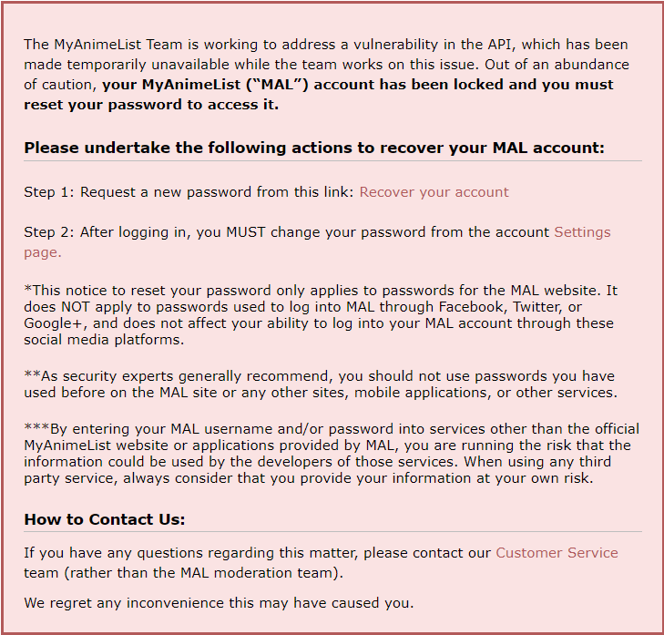
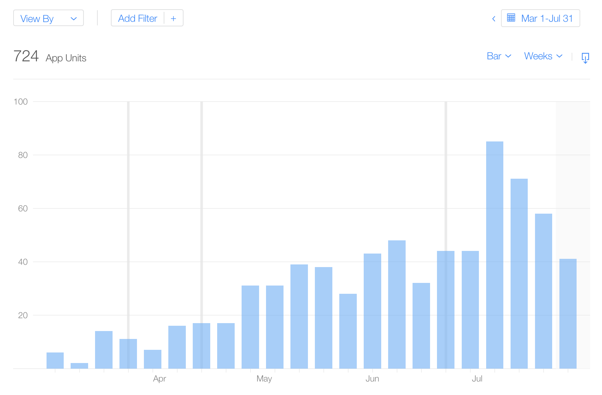

+++
title = "One Year on the App Store"
date = 2020-08-01T17:43:00-04:00
tags = ["programming", "ryuusei", "weeb"]
+++

About a year ago I released [Ryuusei](https://ryuusei.moe) on the App Store. Ryuusei is one of the first side projects I started, certainly the side project I've put the most time and effort into, and the first app I've put on the App Store on my personal developer account. All told, it's a Pretty Big Deal™ for me! It was a huge moment when I hit the button to release it to the world.

I meant to write a blog post soon after releasing the first version of Ryuusei, but time got away from me, and before long it felt like it wasn't the "right" time anymore. Now a year later, it feels like as good a time as any to talk about why I started Ryuusei, how it ended up where it is today, and a bit about where I plan to take it.

## How Did I Even Get Here?

In 2015, I started getting into anime. My setup was a little on the strange side. It involved a laptop on the floor plugged into my TV with HDMI, using VLC to play files on my home server. I sat on the couch and used a [VLC remote app](https://apps.apple.com/us/app/vlc-remote-lite/id299344206) on my iPad to control things to some extent without getting up.

This worked, but wasn't great. At some point I learned about [Plex](https://www.plex.tv/) and set that up on my server, and got Plex Home Theater (now Plex Media Player) on the laptop, and used Plex on my iPad to control playback on the laptop. Soon enough the 4th generation Apple TV came out, and it had an App Store! And the App Store had Plex! My method of _watching_ shows was now streamlined, but I had another problem: tracking what I was watching (and wanted to watch in the future).

## The MyAnimeList Era

When I got started, I used MyAnimeList[^1] (MAL) to keep track of what I was watching, what I wanted to watch, and to get information about the voice actors and other staff in the shows. It seems like a lot of people tend to watch anime on their computers for some reason, so a lot of supporting applications tend to think about that use case. For instance, [Taiga](https://taiga.moe/) is an application that can help you play files out of your library of shows, pay attention to your playback progress, and automatically update your progress on MAL (at the time) when you've watched the episode.

That's great, but I'm using Plex, an Apple TV, and an iPad. Automatically updating my list could be accomplished with a Plex plugin, but I wanted more. Something I did a lot was check out who voiced a character to see what else they had been in (either to find more shows to watch, or figure out why a voice sounded familiar). Of course I could visit MAL on my iPad, but the mobile website was limited and difficult to navigate, while the desktop website did what I wanted but was even more painful to navigate on my iPad.

There were a couple of apps on the App Store for MAL, namely [iMAL](https://myanimelist.net/forum/?topicid=517387&show=0) and [MyAniList](https://apps.apple.com/us/app/myanilist/id741257899). I tried both to some extent, and came away wanting more. Most importantly, neither app had information about the voice actors and staff for a show.

You can probably guess where this is going: seeing that no apps did what I wanted, and being too stubborn to put up with the website on my iPad, I decided to write my own iOS app for MyAnimeList.

### Learning Some PHP

One of the first orders of business in getting started on my app was to figure out how to get data from MAL. I pretty quickly determined that while MAL _did_ have an API, it was XML-based and covered only some very basic features.

I happened upon [Atarashii API](https://bitbucket.org/animeneko/atarashii-api/src/master/), an unofficial API made by the developers of the [Atarashii app for Android](http://atarashiiapp.com). Not only did this API use JSON, but it also covered many more features of MAL. It did so by scraping the contents of pages on MAL. As luck would have it, I had a spare computer sitting around, so I dusted it off and set up Atarashii API on it so I'd have it running 24/7 somewhere.

Before I started coding my app, I knew that I wanted to have pages in the app for staff and voice actor detail. This was a unique feature for a MAL app on iOS at the time. However, Atarashii API didn't support that yet. Someone had opened [an issue](https://bitbucket.org/animeneko/atarashii-api/issues/63/api-query-for-people-details) a year earlier asking about it. They said they had implemented it on their fork, but I didn't see it anywhere.

I desperately wanted this functionality, so I stumbled my way around the Atarashii API codebase and wrote some PHP. Once I had it working, I made a pull request, and it was merged! That alone was pretty exciting; it was the first sizable contribution I had made to an open source project. It also meant I had a way to make one of the features that I really wanted in my app.

### Picking a Name

I had already started designing the app, and was getting hung up on the login page. There was a big blank space at the top where the app's name would go. The problem was that I didn't have a name for it yet.

I wanted the login screen to look pretty, and felt like the name should tie in to whatever was on the login screen. I was chatting with my brother about it, and we sort of landed on something space-themed. We started out with "uchuu" (宇宙) (space). It felt friendly enough for English-speakers to say, and it helped that some anime had it in their names (notably [Uchuu Patrol Luluco](https://anilist.co/anime/21637/Uchuu-Patrol-Luluco/) had come out recently). I started updating colors on the design to incorporate things that felt kind of space-like, hence where all the purple came from throughout the app.

Somewhere along the line, my brother thought of a word that had prettier kanji, and was still space-themed: ryuusei (流星) (meteor). I liked it, I didn't see any apps using the name already (unlike uchuu), and it was easy enough to find [a nice background image](https://commons.wikimedia.org/wiki/File:Cosmic_Fireball_Falling_Over_ALMA.jpg) for the login and splash screens.

And so the app became Ryuusei. I made the first commit to the project on May 22, 2016. It's hard to tell exactly when things started working, but I think I was able to use the app for basic tasks within a couple of months, and slowly continued adding more functionality the rest of the year.

I was using the app on my devices, but I didn't have a paid Apple Developer at the time. Luckily, Apple had just loosened up restrictions on being able to install apps onto physical devices without a paid account. I was able to install my app on my devices for a _whole 7 days_ before it'd expire and I'd have to do it again. It became a weekly ritual to reinstall my app on my phone and iPad, even if nothing had changed.

### Making Progress

I think by the end of 2016 I had a good amount complete on the Dashboard and List tabs, including the anime and manga detail pages. At the beginning of 2017, I got person detail pages up and running. It was around this time that I also got a new job! I felt comfortable enough with my app to show it off a bit during the interview. I was coming in for a position on their frontend web team, but they also did iOS development, and I made it known that was something I could do, and enjoyed doing[^2].

After a year of having the app running on my devices, I finally made an icon for Ryuusei in May of 2017. It's still the same one! Alongside the changes in Ryuusei, I continued making contributions to Atarashii API in the form of bug reports and pull requests.

In August of 2017, just about 6 months after starting my new job, everyone received some shocking news: most of the people at the company were being laid off, myself included.

While extremely disappointing and disorienting (this is an understatement), my sudden lack of employment had a silver lining: I had a _lot_ of free time on my hands. I was about to schedule a nice stretch of time off when we received the news, so in a way I guess I got what I was looking for. Luckily I wasn't in dire need of money at the time, so I decided to take the job hunt a bit slow, and devoted more time to working on Ryuusei. I started thinking about  releasing it on the App Store.

Over the next couple of months, between job interviews, I started making changes that would support a full public release of Ryuusei. Most of the changes were under-the-hood things like handling [MAL IP address blocking](https://myanimelist.net/forum/?topicid=1632480&show=0), showing better error messages, and setting up a foundation for localization. These things weren't going to be issues as long as it was just me using the app, but they'd be important if I opened up the app to other people.

I also implemented one of the last two[^3] major top-level features: searching for anime and manga. Toss in a new release of iOS, and the release of a whole new screen type with the iPhone X, and I was very busy throughout September and October of 2017 getting ready for an eventual App Store release.

### On the Precipice

By the middle of October 2017, I started a new job. It was a much further commute, so I found myself with much less free time to work on Ryuusei. Luckily though, I was far enough along that an App Store release was still very much possible. I kept using the app myself for a while to make sure things worked well enough.

The biggest hurdle I had to deal with was that of the API server. Remember, Atarashii API was running on a computer in my home. This wasn't going to cut it if I released Ryuusei publicly. But...what _would_? I wasn't really sure what I'd need, and I wasn't sure how much I'd be comfortable spending on it all. This point lingered in the back of my mind for months, and was kind of demotivating. Ryuusei was going to be a free app. On top of Apple's $100/year developer account, how much did I really want to spend on an app that didn't earn me any money?

I sat on the app for a little while into 2018. I still _really_ wanted to release the app publicly. I figured I could get away with a low-tier DigitalOcean VM to start. I decided to enroll in the Apple Developer program in February. I was getting close to dropping a bit of money on a server, a domain, and a developer account. Then it happened.

### The Great MAL API Shutdown

On May 24, 2018[^4], MyAnimeList greeted its users with the following banner on the home page of the site:

<small>(Image: MAL forcing all users to reset their passwords)</small>

Setting aside the forced password reset, people in the community were [none too pleased about the API being shut down](https://old.reddit.com/r/anime/comments/8lsm5i/myanimelist_compromisedvulnerable_probably_best/). In particular, [no communication was sent to 3rd party developers beforehand](https://old.reddit.com/r/anime/comments/8lsm5i/myanimelist_compromisedvulnerable_probably_best/dziwjck/). We[^5] found out at the same time as every other user of MAL that the API was shut down until further notice. (Even though the Atarashii API was scraping most data from MAL's website, the ability to log into your account and make changes to your list was still governed by MAL's API.)

That evening, I booted up my old Android tablet to check how the official MAL app was working. Their official app had come out earlier in 2018 for Android only. The app had been delisted, but I already had it installed. Surprisingly (or maybe not?), their own app was working fine. That rubbed me the wrong way. Apparently around this time, there was also a [beta API that MAL invited some developers to use](https://twitter.com/spacepyro/status/999783241207824385), and it's likely that API is what was supporting MAL's official app.

At this point, we still hadn't heard more about the forced password reset. These problems led me to export my lists to XML files and start looking seriously at alternate sites, including AniList and Kitsu. AniList in particular was attractive: they had a new GraphQL-based API, and their data was more complete than Kitsu's (though not quite as good as MAL's). Unfortunately, importing from MAL via XML files wasn't available at that moment; you could only import via the MAL API, which of course was down. Luckily, the AniList team was on top of things, and had MAL XML importing back on the site on May 26, coupled with a whole redesign of the site to boot!

Meanwhile, after 2 days of relative silence from MAL, the administrators posted [an update on the situation](https://myanimelist.net/forum/?topicid=1731860) on May 26. Unfortunately they couldn't offer much information beyond what we already knew. I don't fault the MAL admins here; it seemed like DeNA, MAL's parent company at the time, was the one dropping the ball.

On May 28, MAL went down for maintenance, and remained down for days. When it came back online, large chunks of the site were still locked down for maintenance, including the forums. The forums wouldn't come back up until August. The rest of the site was finally restored in September. The notable exception was the API, which remained down with no real update on the situation[^6].

The community had some thoughts about what was going on, but I don't think any additional details beyond "a vulnerability" were ever confirmed by DeNA. My general theory is that the company took down most of the site to figure out how to deal with GDPR, which had just gone into effect. As part of that, they probably decided that having the API continue to use HTTP Basic authentication (as opposed to using something like OAuth) was probably not a risk worth taking going forward. After all, using HTTP Basic auth meant that users' credentials were in full view of 3rd party applications—Ryuusei, for instance, had to securely store users' credentials, and send them for each request that required authentication.

## The AniList Era

Regardless of the reasons for MAL's API shutdown, by May 26 I had finished migrating my data to AniList. The next thing to handle was getting my app to work with AniList.

### Making it Work Again

This went on piecemeal over a few months starting with the ability to log into an AniList account, which I finished within a day or so of migrating to AniList. By mid-June I could view my lists again and make edits to items on my Dashboard. That functionality alone served me well enough that I didn't get anime detail pages working until mid-July, with manga detail pages coming at the end of the month. In November, I had staff-related features working again. December saw the repair of the Discover tab of the app, and the complete removal of everything left over that was related to MyAnimeList.

While I was working on updating my app, other developers were doing the same for theirs. [Taiga](https://anilist.co/forum/thread/2846) had actually worked with AniList prior to the MAL debacle. MyAniList [migrated](https://anilist.co/forum/thread/4057) from MAL to AniList around late June 2018, and [various](https://anilist.co/forum/thread/2995) [other](https://anilist.co/forum/thread/2958) AniList apps for iOS became available around spring / summer 2018.

### On the Precipice (Again)

Now that Ryuusei worked with AniList, I had less to worry about if I wanted to release it to the public. Most notably, there was no longer a server requirement on my side since AniList had a proper API that did everything I wanted (and more). I again shifted to doing work that'd be needed for other people to use the app. Most notably, AniList allows users to use one of a few different scoring systems: 10-point, 10.0-point, 100-point, 5-point, and smilies. Being a MAL refugee, I only used the 10-point scale. By March 2019, I had the rest of the scoring systems in a usable state. By June, I had also added the ability to see media tags (something I desperately wanted), and I had the app handling expired auth tokens.

In mid-June, I hid whatever features I hadn't implemented yet, fixed a few dangling bugs that I happened upon, bought [a domain](https://ryuusei.moe) and set up a website, email, and a [Twitter account](https://twitter.com/RyuuseiApp).

Once I had all my ducks in a row, I submitted the app for external TestFlight review with Apple.

### Getting on the App Store

Unfortunately, Ryuusei was initially rejected from TestFlight. They argued that the app was forcing users to sign in with an account for things that didn't strictly need an account. They were correct. Using the app without logging in was something I had in the backlog, but I didn't feel the app did enough _without_ an account to warrant doing it yet. I explained that to the App Review team, and thankfully they seemed to agree and approved Ryuusei.

On July 3, 2019, I launched a very small closed TestFlight beta. By "very small" I mean about 3 testers. While I expected a few more, I didn't let it faze me. Over the next 10 days, I dealt with a couple of issues. Otherwise everything was looking good, so I opened up a public TestFlight beta for people to try, which a small handful of people joined (i.e. less than 10).

Finally, on July 31, 2019, I publicly released Ryuusei on the App Store!

### Updates

Coinciding with the release on the App Store, I began working on supporting iOS 13, which was going to add Dark Mode when it came out in the fall. Ryuusei was already dark, so I was actually adding a Light Mode, and tweaking the Dark Mode colors to be more in line with what Apple's apps looked like. Miraculously, I had this version of the app ready to go right in line with the release of iOS 13 in mid-September.

Since then, I've released 4 other updates to Ryuusei. Admittedly that isn't many updates, but I was happy with what I was able to accomplish: a bunch of small bug fixes, sorting your Dashboards, switching between [average and mean scores](https://ryuusei.moe/help/default-community-score-algorithm/), searching for staff, adding Relations and Recommendations, opening AniList links from the clipboard, and the ability to use the app without logging in[^7]!

### Users?

I mentioned a bit about how few people used the TestFlight betas. You may be wondering, "how many people use the app?" Good question!

Honestly, more people have ended up using it over the past year than I reasonably expected. In the past year, Ryuusei has had just shy of 1000 first-time downloads. At the time of writing, of the devices opted in to reporting usage information back to Apple, about 130 devices have been active within the past 30 days. I've particularly seen a sizable uptick in downloads since April, which coincides with when Ryuusei was added to AniList's [apps page](http://anilist.co/apps).

<small>(Image: First-time downloads per week between March 1, 2020 and when this post was published.)</small>

On top of that, some people have even gone out of their way to rate Ryuusei, which I really appreciate. Worldwide, Ryuusei has received 10 ratings, with an average of 4 out of 5 stars. (There was also a review at one point, but it seems to have disappeared. Still, I really appreciate it, whoever that was!)

These numbers aren't big by any means, but I'm more than happy with them. I see Ryuusei as an app I made primarily for myself, so the fact that a couple hundred people seem to be benefitting from it is wonderful news!

There is one number that's very low that I'm very happy with: crashes. Over its lifetime in the App Store, Ryuusei has had only 3 crashes reported from devices that are opted into sending that data to Apple. The even better news is that at least 2 of them are the same. I was aware of this crash prior to reports coming in, I've just never gotten around to fixing it. It's an edge case of an edge case, so to speak. The crash happens if the user tries to update an item on their list from the media details screen, and then they navigate away[^8], _and then_ the update fails. Ironically, the app tries to show an error message in this situation, but crashes in the process. I'm happy to report that I've finally gotten around to solving this issue, and the fix is coming in the next version.

## The Future

Speaking of the next version, I wanted to share a bit about where I see Ryuusei going from here in terms of features.

At the time of writing, I am in the middle of version 1.5.0, which will be bringing some features to help make navigating your lists easier, based on some feedback I've received from users. These are things I've had in my backlog, but hearing from people who wanted them made me bump them up in priority. Expect to see the ability to search locally in the List tab, sort your lists similar to how you can sort your Dashboard. I'm also hoping to sneak one surprise feature into this version that I personally have been wanting for a while. It's something that I find myself repeatedly having to open an anime/manga on AniList's website to see.

After 1.5.0, I expect the next version will be about iOS 14 compatibility, and preparing to remove support for iOS 12. Luckily iOS 14 is shaping up to be less of a breaking release for me than iOS 13, so I expect this update to be small.

After that...well, let's just say I have 88 tickets on my [GitLab](https://about.gitlab.com) board that I want to get around to, and that number tends to go up more often than it goes down. Everything from under-the-hood cleanup, even more details about media, more editing controls for your list, improved editing controls for what you can edit already (I'm really starting to hate the buttons that are there today), support for text formatting in places like media descriptions and staff bios, and some features that will finally warrant unhiding that tab I mentioned in a footnote!

If the past few years of developing Ryuusei tell me anything, it's that these features aren't going to be done any time soon. After all, I'm just one person doing this for fun in what little spare time I have. But I love doing it, and I want to see Ryuusei continue to get better, if only because I use it daily.

Here's to one year in the App Store, and more to come!

[^1]: Unlike most tools/sites/apps you'll see in this post, I'm not linking to MyAnimeList. As you continue to read this post, you'll understand why. Ooo, foreshadowing.

[^2]: Ultimately I never got to work on the iOS project. I _did_ get to work on the Android project, though! Given a little more time I probably would have stuck my nose into the iOS project too.

[^3]: One of these top-level features still isn't in the app. There's a spot for it on the tab bar, but it's not connected. But it's still there in the code, haunting me. I'll get around to it someday.

[^4]: The day before GDPR went into effect

[^5]: I hesitate to include myself in that group, since my app wasn't in the App Store yet.

[^6]: It took a little more than 2 years for MAL to open up an API again. Just a few weeks before this post, on July 6, 2020, MAL released version 2 of their API, complete with OAuth for authentication instead of HTTP Basic auth.

[^7]: The lingering potential threat of the app being rejected at any point got to me, and I figured the app now did enough to add this. At the same time, there was a notable [fiasco going on with HEY and Apple](https://hey.com/apple/) revolving around [apps that didn't "work" when you first launched them](https://youdownloadtheappanditdoesntwork.com).

[^8]: To keep the app feeling fast, Ryuusei doesn't show loading indicators the majority of the time, so users can navigate around even when there are API requests in flight. This is very much a reflection of the app being built "for me," because my internet connection is sufficiently fast that this hardly ever causes an issue. I'm aware that this likely isn't the case for everyone, and I do plan to address this in the future.
