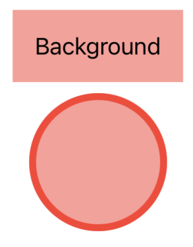
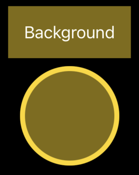

+++
title = "Dynamic Colors in SwiftUI using ShapeStyle in iOS 17"
date = 2023-07-13T00:38:00-04:00
tags = ["programming", "swiftui"]
+++

Jesse Squires recently [asked on Mastodon](https://mastodon.social/@jsq/110690642657239551) whether SwiftUI still lacked support for dynamic colors. Ultimately he [shared a solution](https://www.jessesquires.com/blog/2023/07/11/creating-dynamic-colors-in-swiftui/) that uses `UIColor` / `NSColor` under the hood to achieve the desired effect. There are other solutions floating around like [one from John Sundell](https://swiftbysundell.com/articles/defining-dynamic-colors-in-swift/) that work in a similar way.

We'll need to keep doing that as long as we need to support iOS 16, but with iOS 17 and aligned releases SwiftUI finally has a built-in answer for this: [custom `ShapeStyle`s](https://developer.apple.com/documentation/swiftui/shapestyle).

I'll start with a quick question that may be on your mind: what do shapes have to do with colors?

## `foregroundColor(_:)` is Deprecated

In case you missed it, iOS 17 et al. have deprecated the [`foregroundColor(_:)`](https://developer.apple.com/documentation/swiftui/view/foregroundcolor(_:)/) modifier. Instead, Apple says to use [`foregroundStyle(_:)`](https://developer.apple.com/documentation/swiftui/view/foregroundstyle(_:)). You'll note that `foregroundStyle(_:)` takes a `ShapeStyle`, same as [`background(_:ignoresSafeAreaEdges:)`](https://developer.apple.com/documentation/swiftui/view/background(_:ignoressafeareaedges:)).

As it so happens, `Color` conforms to `ShapeStyle`. So in many cases you'll be able to replace usages of `foregroundColor(_:)` with `foregroundStyle(_:)` without changing what you're passing.

Migrating to `foregroundStyle(_:)` also means we can leverage iOS 17's new support for custom `ShapeStyle`s to create dynamic colors!

## Custom `ShapeStyle`s

Before this beta season began, the documentation for `ShapeStyle` led off:
> You don’t use the `ShapeStyle` protocol directly. Instead, use one of the concrete styles that SwiftUI defines.

Now it starts:
> You create custom shape styles by declaring a type that conforms to the `ShapeStyle` protocol and implementing the required `resolve` function to return a shape style that represents the desired appearance based on the current environment.

It goes on to show an example of changing a color's blend mode based on the environment's color scheme.

But we can also use this to switch to an entirely different color! Here's an example of a ShapeStyle that resolves to a color that's based on the current color scheme:

```swift
struct DynamicColorShapeStyle: ShapeStyle {
    let light: Color
    let dark: Color

    func resolve(in environment: EnvironmentValues) -> some ShapeStyle {
        if environment.colorScheme == .light {
            return light
        } else {
            return dark
        }
    }
}
```

You'd use it like this[^1]:

```swift
Text("Hello")
    .foregroundStyle(DynamicColorShapeStyle(light: .red, dark: .yellow))
```

It'd be nice if we didn't have to write out "DynamicColorShapeStyle" all the time though. Luckily we can write a little extension to improve this:

```swift
extension ShapeStyle where Self == DynamicColorShapeStyle {
    static func `dynamic`(light: Color, dark: Color) -> DynamicColorShapeStyle {
        DynamicColorShapeStyle(light: light, dark: dark)
    }
}

// So now this works:
Text("Hello")
    .foregroundStyle(.dynamic(light: .red, dark: .yellow))
```

And that's it! No need to fiddle with `UIColor` or `NSColor` anymore to create a dynamic color in SwiftUI 🎉

I have to say, this doesn't feel very intuitive at first. I think people who need a dynamic color will look for some kind of `Color` initializer like Jesse did, not something that sounds totally unrelated to colors called `ShapeStyle`. I only noticed this while reading Apple's WWDC23 notes about [notable SwiftUI changes](https://developer.apple.com/documentation/Updates/SwiftUI#Shapes) after seeing Jesse's question. And even then, it was under the "Shapes" section, which doesn't feel related to colors initially!

## Digression about `HierarchicalShapeStyle`

Writing this post was the first time I had really used foreground styles, so I wanted to mention some neat behavior I noticed when I was playing around with them.

Setting a foreground style on a container view causes `HierarchicalShapeStyle` to inherit that style throughout the child hierarchy. This means that using `.primary` will resolve to whatever the current foreground style is. More interesting, using `.secondary`, `.tertiary`, and `.quaternary` resolves to lightened versions of the foreground style.

Consider this code:

```swift
VStack {
    Text("Background")
        .foregroundStyle(Color.primary)
        .padding()
        .background(.secondary)

    Circle()
        .strokeBorder(lineWidth: 5)
        .fill(.secondary)
        .frame(width: 100, height: 100)
}
.foregroundStyle(.dynamic(light: .red, dark: .yellow))
```

Here's how that renders:




Note how using `HierarchicalShapeStyle.secondary` (abbreviated to `.secondary` in the code sample) automatically gave us a lightened version of our red/yellow color without us having to define an extra color. Similarly, `.tertiary` and `.quaternary` resolve to even lighter versions of our foreground style.

Also note how we had to use `Color.primary` rather than just `.primary` for the text to get black/white. If we had used `.primary`, it would have resolved to `HierarchicalShapeStyle.primary`, so the text would have been red/yellow instead of black/white.

## Next Steps

`ShapeStyle` can do a lot more than just plain colors. Majid Jabrayilov [wrote about `ShapeStyle`](https://swiftwithmajid.com/2021/11/17/the-many-faces-of-shapestyle-in-swiftui/) and what else it can do. I encourage you to give that a look!

Again, to get a little Xcode project with the code from this post and a little more, check out [this GitHub repo](https://github.com/klanchman/SwiftUIDynamicColorShapeStyle).

Thanks for reading!

[^1]: This example is a little contrived. If you know ahead of time what colors you want your dynamic color to resolve to, you'd be better off [defining the color as an asset](https://developer.apple.com/documentation/uikit/appearance_customization/supporting_dark_mode_in_your_interface#2993897) instead. But if you won't know what colors to use until runtime (maybe they come from a server or user input), then you're in the right place!
